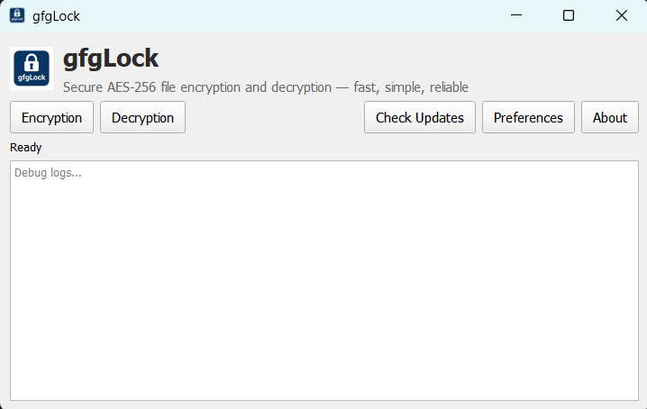
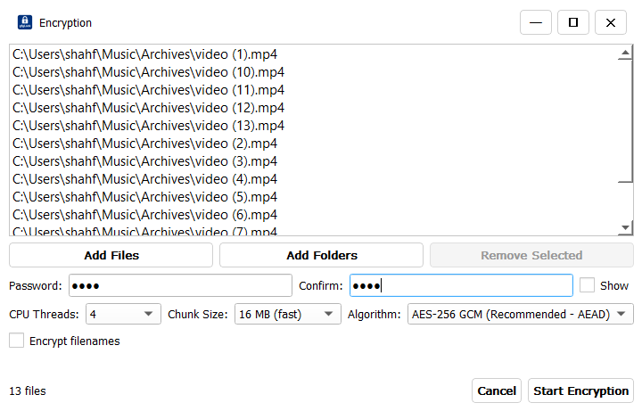
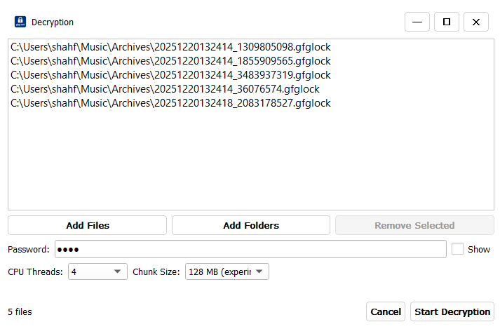
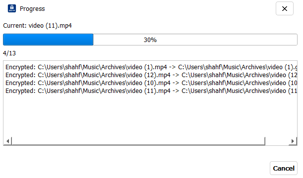
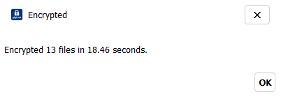
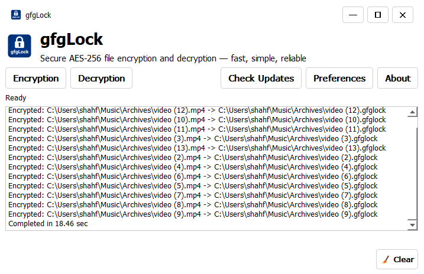
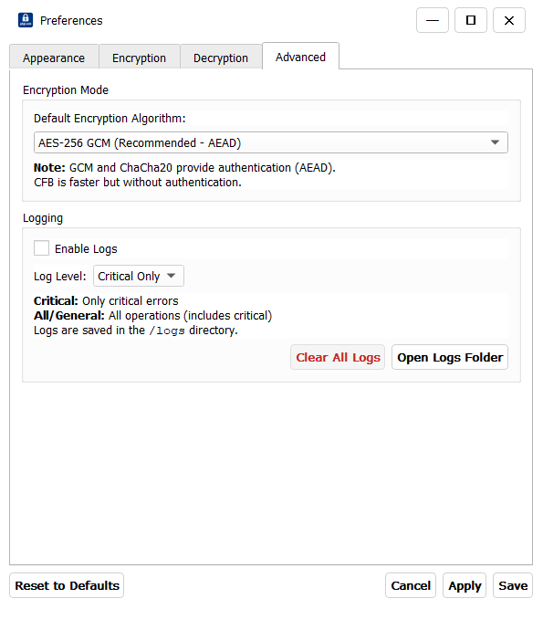
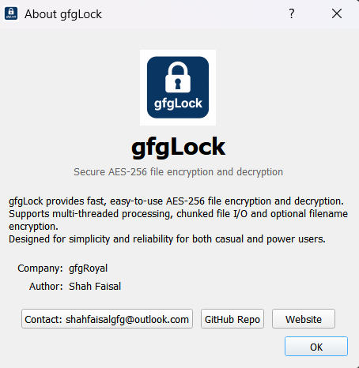

# gfgLock

A compact, secure Windows file-encryption GUI. Supports AES-256 GCM, AES-256 CFB and ChaCha20-Poly1305, batch processing, logging, and theme switching.

[](https://opensource.org/licenses/MIT) [](https://github.com/ShahFaisalGfG/gfgLock/releases) [](https://github.com/ShahFaisalGfG/gfgLock/releases/tag/v2.7.0)

---

## Overview

gfgLock is a focused Windows tool for encrypting files with modern, authenticated ciphers. It aims for a balance of usability and security: fast batch processing, clear logs, and a small, responsive UI.

## Key Features

- Multi-algorithm encryption: AES-256 GCM (`.gfglock`), AES-256 CFB (`.gfglck`), ChaCha20-Poly1305 (`.gfgcha`)
- Batch processing with multi-threading and configurable chunk sizes
- Real-time file-based logging (`%APPDATA%\\gfgLock\\logs\\`)
- Theme support: System / Light / Dark with live Apply
- Preferences with Apply/Save and persistent `settings.json`
- Batch processing with multi-threading and configurable chunk sizes
- Real-time file-based logging (`%APPDATA%\\gfgLock\\logs\\`)
- Theme support: System / Light / Dark with live Apply
- Hardware acceleration where available (AES-NI / platform crypto backends)
- Preferences with Apply/Save and persistent `settings.json`

## Screenshots

#### Main window, dialogs and progress examples

- Main Window

  

- Encryption Window

  

- Decryption Window

  

- Progress Window

  

- Operation Finished Window

  

- Main Screen Progress Logs

  

- Prefrences Window

  

- About Window

  

## Quick Start

1. Download `gfgLock_Setup_2.7.0.exe` from Releases and install.
2. Add files/folders (drag & drop supported).
3. Choose Encrypt or Decrypt, pick algorithm (Encrypt only), enter password, and Start.

### Portable

Run `gfgLock_v2.7.0_portable.exe` — no install required.

## Installation (brief)

- Installer: `gfgLock_Setup_2.7.0exe` (recommended)
- Developer: clone repo, create venv, `pip install -r requirements.txt`, run `python src/gui.py`

## Support & License

- Issues: [gfgLock - Issues](https://github.com/ShahFaisalGfG/gfgLock/issues)
- License: MIT — see `LICENSE`

---

Last Updated: December 21, 2025

## File Extensions & Compatibility

| Algorithm         | Extension  | Format | Use Case                              |
| ----------------- | ---------- | ------ | ------------------------------------- |
| AES-256 GCM       | `.gfglock` | AEAD   | **Recommended** — Modern standard     |
| AES-256 CFB       | `.gfglck`  | Stream | Fast - Simple                         |
| ChaCha20-Poly1305 | `.gfgcha`  | AEAD   | High-security, side-channel resistant |

**Important:**

- Files encrypted with one algorithm cannot be decrypted with another
- Always use the same tool to decrypt that encrypted the file
- Each algorithm produces unique file format headers for verification

---

## Preferences & Settings

### Appearance Tab

- **Theme Selection:** System (default), Light, or Dark mode
- Live preview with Apply button

### Encryption Tab

- **CPU Threads:** 1 to (cores - 1) — balance speed vs. responsiveness
- **Chunk Size:** 8 MB (normal) to 128 MB(heavy) — memory vs. speed tradeoff
- **Encrypt Filenames:** Optional filename randomization

### Decryption Tab

- **CPU Threads:** Performance tuning
- **Chunk Size:** Processing efficiency
- Algorithm auto-detected from file extension

### Advanced Tab

- **Default Algorithm:** Choose default for new encryptions
- **Logging:** Enable/disable comprehensive logging
- **Log Level:** All operations or only critical errors
- **Log Actions:** Clear all logs or open logs folder

---

## Chunk Size Selection Guide

Choose the appropriate chunk size based on your file size and system resources:

| Chunk Size                          | Best For         | RAM Usage                 | Speed          | Notes                                                                                       |
| ----------------------------------- | ---------------- | ------------------------- | -------------- | ------------------------------------------------------------------------------------------- |
| **Off (Stream mode — no chunking)** | Files <10 MB     | Full file in RAM / stream | ⚡ **Fastest** | Recommended for small files; also supports streamed, non-chunk processing (added in v2.7.0) |
| 8 MB                                | **General use**  | ~8 MB buffer              | Fast           | Default; balanced for most systems                                                          |
| 16 MB                               | Larger files     | ~16 MB buffer             | Faster         | Good for files >50 MB; modern systems                                                       |
| 32 MB                               | High-end systems | ~32 MB buffer             | ⚡ Faster      | Files >100 MB; high-speed SSDs                                                              |
| 64 MB+                              | Very large files | ~64+ MB buffer            | ⚡⚡ Fastest   | Enterprise/high-speed NVMe; files >500 MB                                                   |

### Recommendations

- **Laptops/Low RAM (<8 GB):** Use "Off" (no chunking) for small files; or 8 MB chunks for large ones
- **Desktop PCs (8-16 GB RAM):** Normal 8 MB; use 16-32 MB for files >100 MB
- **High-end Systems (16+ GB RAM):** Use 32 MB or 64 MB for best throughput on large files
- **Network/Shared Drives:** Use smaller chunks (8 MB) for stable, consistent performance

---

## Encryption Algorithm Selection

Choose the right algorithm for your security and performance needs:

### AES-256 GCM (Recommended - `.gfglock`)

- **Speed:** (⚡⚡)
- **Security:** ✅ Authenticated encryption (AEAD)
- **Use When:** You need strong security with authentication; general-purpose encryption
- **Best For:** Documents, sensitive data, compliance requirements
- **Overhead:** Includes authentication tag (16 bytes per file)

### AES-256 CFB (Fast - `.gfglck`)

- **Speed:** (⚡⚡⚡)
- **Security:** ⚠️ No built-in authentication (stream cipher)
- **Use When:** You need maximum speed and authentication is handled separately
- **Best For:** Large file batches, archival, non-sensitive data, speed-critical applications
- **Advantage:** ~40% faster than GCM; simpler encryption mode
- **Note:** Recommended to verify file integrity separately (e.g., checksums)

### ChaCha20-Poly1305 (AEAD - `.gfgcha`)

- **Speed:** (⚡)
- **Security:** ✅ Authenticated encryption (AEAD)
- **Use When:** You prioritize side-channel resistance; low-power/older CPU systems
- **Best For:** High-security applications, systems without AES-NI, cryptography purists
- **Advantage:** Resistant to timing attacks; excellent on CPU without hardware AES
- **Note:** Pure software implementation (no hardware acceleration)

### Quick Decision Matrix

```bash
├─ Need Maximum Security?
│  ├─ YES → Use AES-256 GCM (AEAD + Hardware Accelerated)
│  └─ NO  → Use AES-256 CFB (Faster, no authentication)
│
└─ Concerned About Side-Channels?
   ├─ YES → Use ChaCha20-Poly1305 (Timing-resistant)
   └─ NO  → Use AES-256 GCM (Default, balanced)
```

---

## Logging

Logs are stored in:

- **Windows:** `%APPDATA%\gfgLock\logs\`
- **Development:** `src/logs/`

### Log Files

| File                   | Contents                                            |
| ---------------------- | --------------------------------------------------- |
| `gfglock_general.log`  | All operations (verbose, when "All" level selected) |
| `gfglock_critical.log` | Errors and critical issues only                     |

---

## Security Notes

### Encryption Standards

- **AES-256 GCM** — 256-bit symmetric encryption + Galois/Counter Mode authentication
- **AES-256 CFB** — 256-bit symmetric encryption + Cipher Feedback mode + HMAC authentication
- **ChaCha20-Poly1305** — 256-bit stream cipher + Poly1305 MAC (AEAD)

### Key Derivation

```bash
User Password
     ↓
SHA-256 hash + random salt (16 bytes)
     ↓
PBKDF2 (200,000 iterations)
     ↓
256-bit encryption key
```

### Best Practices

- ✅ **Strong Passwords:** 12+ characters with mixed case, numbers, symbols
- ✅ **Unique Passwords:** Different password for each file set
- ✅ **Algorithm Choice:**
  - GCM → General purpose (recommended)
  - CFB → Simple Legacy Fast
  - ChaCha20 → Maximum security/side-channel resistance
- ✅ **Secure Storage:** Keep encrypted files in safe locations
- ✅ **Audit Trail:** Enable logging for compliance/verification
- ✅ **Password Privacy:** Never share passwords via email/chat

## Project Structure

```bash
gfgLock/
├── src/
│   ├── gui.py                           # Main application & dialogs
│   ├── core/
│   │   ├── aes256_gcm_cfb.py            # AES-256 encryption (GCM/CFB)
│   │   └── chacha20_poly1305.py         # ChaCha20-Poly1305 encryption
│   ├── services/
│   │   └── worker.py                    # Multi-threaded operations dispatcher
│   ├── views/
│   │   └── preferences.py               # Settings dialog with tabs
│   ├── utils/
│   │   ├── gfg_helpers.py               # Helpers (logging, settings, resource_path)
│   │   ├── theme_manager.py             # Dynamic theme system
│   │   └── settings.json                # Default settings
│   ├── widgets/
│   │   └── custom_title_bar.py          # Frameless window title bar
│   └── assets/icons/
│       ├── gfgLock.png                  # Application icon
│       └── gfgLock.ico                  # Windows icon
├── installer/
│   ├── gfglock_installer.iss            # Admin installer (Inno Setup)
│   └── gfglock_installer_non_admin.iss  # Per-user installer (Inno Setup)
├── requirements.txt                      # Python dependencies
├── README.md                             # This file
└── LICENSE                              # MIT License
```

---

## Dependencies

| Package      | Purpose            | Version |
| ------------ | ------------------ | ------- |
| PyQt6        | GUI framework      | 5.15+   |
| cryptography | AES-256 encryption | 3.4+    |
| pycryptodome | ChaCha20-Poly1305  | 3.4+    |

**Full list:** See [requirements.txt](requirements.txt)

---

## Development

### Setup Development Environment

```bash
# Clone repository
git clone https://github.com/ShahFaisalGfG/gfgLock.git
cd gfgLock

# Create virtual environment
python -m venv venv
source venv/Scripts/activate  # Windows: venv\Scripts\activate

# Install dependencies
pip install -r requirements.txt

# Run application
python src/gui.py
```

### Building Installers

Requires [Inno Setup](https://jrsoftware.org/isinfo.php) (Windows) and PyInstaller:

```bash
cd src

# Build multi-folder exe
pyinstaller --noconfirm --clean --windowed \
  --add-data "assets/icons/gfgLock.png;assets/icons" \
  --add-data "assets/icons/gfgLock.ico;assets/icons" \
  --icon "assets/icons/gfgLock.ico" \
  --name gfgLock gui.py

# Build single-file portable exe
pyinstaller --noconfirm --clean --windowed --onefile \
  --add-data "assets/icons/gfgLock.png;assets/icons" \
  --add-data "assets/icons/gfgLock.ico;assets/icons" \
  --icon "assets/icons/gfgLock.ico" \
  --name gfgLock_portable gui.py \
  --distpath dist_portable

# Build installers (from project root)
cd ..
iscc installer/gfglock_installer.iss          # Admin installer
iscc installer/gfglock_installer_non_admin.iss # Per-user installer
```

---

## Troubleshooting

### Common Issues

| Issue                                | Solution                                                                      |
| ------------------------------------ | ----------------------------------------------------------------------------- |
| Could not parse stylesheet" warning  | Harmless Qt message; ignore (no data loss)                                    |
| Files fail to decrypt                | Verify extension (`.gfglock`, `.gfglck`, `.gfgcha`), password, file integrity |
| Performance slow                     | Increase CPU Threads, reduce Chunk Size, close other apps                     |
| Logs not created                     | Enable logs in Advanced settings, check `%APPDATA%\gfgLock\logs\` permissions |
| Context menu missing                 | Re-run installer with admin privileges                                        |

### Getting Help

- 📝 [GitHub Issues](https://github.com/ShahFaisalGfG/gfgLock/issues) — Report bugs
- 💬 [GitHub Discussions](https://github.com/ShahFaisalGfG/gfgLock/discussions) — Ask questions
- 📧 [Email](mailto:shahfaisalgfg@outlook.com) — Direct contact

---

## Version History

### v2.7.0 (Current) — December 21, 2025

- ⚡ Performance: Optimized encryption algorithms for improved speed and efficiency
- 🛠 Hardware: Added hardware acceleration support (AES-NI) and improved crypto backend detection
- 🔁 Streaming: Added streamed/non-chunk mode (`chunk_size`: Off) for small files and streaming use-cases
- ✅ Stability: Minor fixes and reliability improvements

### v2.6.9 — December 19, 2025

- ✨ Multi-algorithm support (AES-256 GCM/CFB, ChaCha20-Poly1305)
- ✨ Comprehensive logging system
- ✨ Dynamic theme support (System/Light/Dark)
- ✨ Smart file filtering by mode

### v1.0.0 (Pre-release) — December 11, 2025 [DEPRECATED]

- Initial packaged Windows GUI build
- AES-256 CFB only
- Basic logging
- Drag & drop support

**Note:** v1.0.0 was a pre-release and has been removed from GitHub releases. Upgrade to v2.7.0 for latest features and security.

---

## Roadmap

Future releases planned (Major):

- 🔮 **v2.7.0** — Enable Hardware acceleration, optimize performance
- 🔮 **v2.8.0** — Resumable/pause operations for large files
- 🔮 **v3.0.0** — Context-Menu Fix
- 🔮 **v3.1.1** — File integrity verification (checksums)

---

## Contributing

Contributions welcome! Bug fixes, features, and documentation improvements are appreciated.

### Quick Start

1. **Fork** the repository on GitHub
2. **Clone** your fork: `git clone https://github.com/<your-username>/gfgLock.git`
3. **Add upstream:** `git remote add upstream https://github.com/ShahFaisalGfG/gfgLock.git`
4. **Sync:** `git fetch upstream && git checkout development && git pull upstream development`
5. **Branch:** `git checkout -b feature/your-feature` (use clear names like `feature-encryption-progress` or `bugfix-null-error`)
6. **Commit:** `git add . && git commit -m "Add: description of change"`
7. **Push:** `git push origin feature/your-feature`
8. **PR:** Open a Pull Request with **base branch: development**

### Before Contributing

- For bugs/features, open an [issue](https://github.com/ShahFaisalGfG/gfgLock/issues) first
- Follow existing code patterns
- Write clean, documented code

---

## License

MIT License

This software is provided "AS IS" without warranty of any kind.

---

## Credits

**Developer:** Shah Faisal (gfgRoyal)

**Repository:** [github.com/ShahFaisalGfG/gfgLock](https://github.com/ShahFaisalGfG/gfgLock)

**Portfolio:** [shahfaisalgfg.github.io/shahfaisal/](https://shahfaisalgfg.github.io/shahfaisal/)

**Email:** <shahfaisalgfg@outlook.com>

---

## Support & Feedback

- 📝 **Issues:** [GitHub Issues](https://github.com/ShahFaisalGfG/gfgLock/issues)
- 💬 **Discussions:** [GitHub Discussions](https://github.com/ShahFaisalGfG/gfgLock/discussions)
- 📧 **Contact:** <shahfaisalgfg@outlook.com>
- 🌐 **Website:** [shahfaisalgfg.github.io](https://shahfaisalgfg.github.io/shahfaisal/)

---

**Stay Secure. Encrypt Responsibly.** 🔐

Last Updated: January 27, 2026
