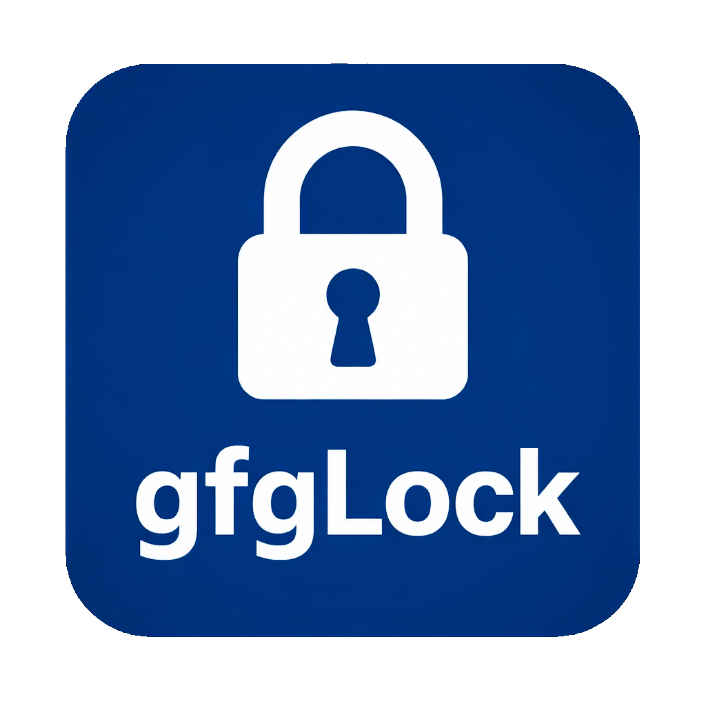

<div align="center">



# gfgLock

**Military-grade file encryption for Windows — fast, simple, no cloud.**

[](LICENSE)
[](https://github.com/ShahFaisalGfG/gfgLock/releases)
[](https://github.com/ShahFaisalGfG/gfgLock/releases/latest)
[](https://winstall.app/apps/gfgRoyal.gfgLock)


</div>

---

## Table of Contents

- [Why gfgLock?](#why-gfglock)
- [Features](#features)
- [Download & Install](#download--install)
- [Quick Start](#quick-start)
- [Screenshots](#screenshots)
- [Encryption Algorithms](#encryption-algorithms)
- [Security](#security)
- [Settings & Preferences](#settings--preferences)
- [Building from Source](#building-from-source)
- [Troubleshooting](#troubleshooting)
- [Contributing](#contributing)
- [Roadmap](#roadmap)
- [Changelog](#changelog)
- [License & Credits](#license--credits)

---

## Why gfgLock?

Most encryption tools are either too complex to use daily or too simple to actually trust with sensitive data. gfgLock sits in the middle: **real cryptography, real usability**.

- 🔒 **No accounts, no cloud, no telemetry** — your files never leave your machine
- ⚡ **Hardware-accelerated** via a native C++ extension backed by OpenSSL, with a seamless Python fallback on every system
- 🎨 **Clean, modern UI** built with PySide6 + QML — System, Light, and Dark themes
- 🧩 **Three authenticated cipher modes** so you choose the right tool for the job

---

## Features

- **Multi-algorithm encryption** — AES-256 GCM (`.gfglock`), AES-256 CFB (`.gfglck`), ChaCha20-Poly1305 (`.gfgcha`)
- **Native C++ engine** — OpenSSL-backed hardware acceleration with transparent Python fallback
- **Batch processing** — encrypt or decrypt whole folders in one operation with multi-threading
- **Real-time progress** — per-file progress bar with remaining time estimation
- **Chunk-based processing** — configurable chunk sizes from 8 MB to 128 MB for large files
- **File Explorer context menu** — right-click any file → *Encrypt with gfgLock* / *Decrypt with gfgLock*
- **Drag & drop** — drop files or folders directly onto the window
- **Three install variants** — system-wide, per-user (no admin), and portable
- **Detailed logging** — full activity or critical-only log levels, stored in `%APPDATA%\gfgLock\logs\`
- **Live theme switching** — System / Light / Dark with instant preview

---

## Download & Install

### Installers

| Package | Admin Required | Best For |
| --- | :---: | --- |
| [`gfgLock_3.0.0_system_installer.exe`](https://github.com/ShahFaisalGfG/gfgLock/releases/latest) | ✅ | Shared / corporate machines |
| [`gfgLock_3.0.0_user_installer.exe`](https://github.com/ShahFaisalGfG/gfgLock/releases/latest) | ❌ | Personal machines — recommended |
| [`gfgLock_3.0.0_portable.exe`](https://github.com/ShahFaisalGfG/gfgLock/releases/latest) | ❌ | USB drives, no-install environments |

Compressed `.7z` archives for all three variants are also available on the [Releases](https://github.com/ShahFaisalGfG/gfgLock/releases) page.

### Windows Package Manager (winget)

```powershell
winget install gfgRoyal.gfgLock
```

---

## Quick Start

1. **Add files** — drag & drop, or use **Add Files** / **Add Folder**.
2. **Choose Encrypt or Decrypt** — click the corresponding button.
3. **Enter your password** — 12+ characters recommended; see [Security](#security).
4. **Start** — hit **Start** and watch the real-time progress.

Encrypted files land in the same folder with the algorithm's extension. To decrypt, open an encrypted file or drag it onto gfgLock — the algorithm is auto-detected from the extension.

---

## Screenshots

<details>
<summary>📸 Click to expand all screenshots</summary>
<br />

| Encryption | Decryption |
|---|---|
|  |  |

| Progress | Completed |
|---|---|
|  |  |

| Activity Logs | Preferences |
|---|---|
|  |  |

</details>

---

## Encryption Algorithms

| Algorithm | Extension | Type | Recommended For |
|---|---|---|---|
| **AES-256 GCM** | `.gfglock` | AEAD | ✅ General purpose — default choice |
| **AES-256 CFB** | `.gfglck` | Stream | Large batches, speed-critical workflows |
| **ChaCha20-Poly1305** | `.gfgcha` | AEAD | CPUs without AES-NI, side-channel resistance |

### Quick Decision

```
Need strong, authenticated encryption?
  → AES-256 GCM  (authenticated, hardware-accelerated, recommended)

Need maximum throughput on large file batches?
  → AES-256 CFB  (~40 % faster than GCM; verify file integrity separately)

On older hardware or need timing-attack resistance?
  → ChaCha20-Poly1305  (AEAD, constant-time, no AES-NI required)
```

> ⚠️ **Compatibility:** Files encrypted with one algorithm cannot be decrypted with another. The algorithm is auto-detected on decryption via the file extension.
>
> ⚠️ **Version notice:** Files encrypted with v2.7.0 or earlier cannot be decrypted with v2.7.5 or later due to a file-structure change.

---

## Security

### Key Derivation

Your password is never stored or transmitted. A unique encryption key is derived for every operation:

```
Password
  ↓
SHA-256 hash + random 16-byte salt
  ↓
PBKDF2-HMAC-SHA256  (200 000 iterations)
  ↓
256-bit encryption key
```

### What gfgLock Does Not Do

| ❌ No telemetry or usage reporting | ❌ No cloud sync or remote backup |
|---|---|
| ❌ No accounts or registration | ❌ No third-party analytics |

### Best Practices

- Use **strong, unique passwords** — 12+ characters, mixed case, numbers, and symbols
- Keep encrypted files in a **secure location** — gfgLock protects content, not storage
- Enable **logging** for audit trails in compliance-sensitive environments

---

## Settings & Preferences

### Encryption & Decryption

| Setting | Description |
|---|---|
| **CPU Threads** | 1 to *(cores − 1)* — trade raw speed for system responsiveness |
| **Chunk Size** | 8 MB (default) to 128 MB — larger chunks improve throughput on NVMe drives |
| **Encrypt Filenames** | Optionally randomise output filenames |

### Chunk Size Guide

| Size | Best For |
|---|---|
| Off (stream mode) | Files under 10 MB — fastest, full file in RAM |
| 8 MB | General use — balanced default |
| 16–32 MB | Files over 50 MB on modern desktops |
| 64 MB+ | Files over 500 MB on high-end NVMe systems |

### Advanced

| Setting | Description |
|---|---|
| **Default Algorithm** | Pre-select the algorithm at startup |
| **Log Level** | Full (all operations) or Critical (errors only) |
| **Log Actions** | Clear all logs or open the logs folder |

---

## Building from Source

### Prerequisites

- Python 3.11+
- [Visual Studio 2022 Build Tools](https://visualstudio.microsoft.com/downloads/) — *Desktop development with C++* workload
- CMake ≥ 3.25
- [Inno Setup 6](https://jrsoftware.org/isinfo.php)

### Development Setup

```powershell
# 1. Clone
git clone https://github.com/ShahFaisalGfG/gfgLock.git
cd gfgLock

# 2. Create and activate virtual environment
python -m venv .venv
.venv\Scripts\Activate.ps1

# 3. Install dependencies
pip install -r requirements.txt

# 4. Run without building
python -m gfglock
```

### Full Build (Native Extension + All Installers)

```powershell
.\scripts\build.ps1
```

This single command runs `scripts\build_native.ps1` (bootstraps vcpkg, compiles OpenSSL + pybind11, builds CMake project), then PyInstaller bundling, then Inno Setup compilation. Output lands in `build\installer\`.

> **First run note:** vcpkg will clone from GitHub and download OpenSSL — internet access required.

---

## Troubleshooting

| Issue | Solution |
|---|---|
| *"Could not parse stylesheet"* warning | Harmless Qt startup message — no data loss, safe to ignore |
| File fails to decrypt | Verify extension (`.gfglock`, `.gfglck`, `.gfgcha`), password, and file integrity |
| Slow performance | Increase CPU Threads and/or chunk size; close background applications |
| Context menu not appearing | Re-run the installer; use *Run as administrator* for the system installer |
| Logs not created | Enable logging in **Advanced** settings; check permissions on `%APPDATA%\gfgLock\logs\` |

Still stuck? [Open an issue](https://github.com/ShahFaisalGfG/gfgLock/issues) and attach your log file plus the gfgLock version — I'll get back to you.

---

## Contributing

All contributions are welcome — bug fixes, features, translations, documentation.

1. **Fork** the repository and clone your fork.
2. Create a feature branch: `git checkout -b feature/your-feature`
3. Make your changes:
   - Run `pyright` on any edited Python files.
   - Run `qmllint` on any edited `.qml` files.
4. Commit with a clear message and open a **Pull Request** targeting the `development` branch.

For significant changes please [open an issue](https://github.com/ShahFaisalGfG/gfgLock/issues) first to discuss the approach — it saves everyone time.

---

## Roadmap

| Version | Planned Feature |
|---|---|
| v3.1.0 | Context menu improvements + Local Password Wallet |
| v3.2.0 | File integrity verification (SHA-256 checksums) |
| v3.3.0 | Resumable / pause-and-continue for large file operations |
| v4.0.0 | Cloud-encrypted password backup |

Have a feature idea? [Start a discussion](https://github.com/ShahFaisalGfG/gfgLock/discussions).

---

## Changelog

### v3.0.0 — June 2026 *(current)*
- 🚀 **Native engine:** C++ extension backed by OpenSSL — hardware-accelerated AES-256 GCM/CFB and ChaCha20-Poly1305 with seamless Python fallback
- 🧪 **Test suite:** Full `pytest` coverage — native path, Python fallback, and cross-path round-trip compatibility
- 🔧 **Build:** `scripts/build_native.ps1` automates MSVC + vcpkg + CMake compilation in one command
- 📁 Build scripts reorganised under `scripts/`

### v2.7.5 — May 2026
- 🎨 **UI rewrite:** PyQt6 widgets replaced with PySide6 + QML, Material-style interface
- ⏱️ Remaining time estimation during operations
- 🔑 Auto-focus password field; Enter key starts operation
- 🪵 Fixed log routing — critical and full log levels now correctly separated
- 🏗️ Added `scripts/build.ps1` one-command installer build

### v2.7.0 — December 2025
- ⚡ Optimised cipher performance; AES-NI hardware detection
- 🔁 Stream mode (chunk size *Off*) for small files

### v2.6.9 — December 2025
- ✨ Multi-algorithm support (AES-256 GCM/CFB, ChaCha20-Poly1305)
- ✨ Comprehensive logging, dynamic theme support, smart file filtering

[Full release notes →](release_notes/)

---

## License & Credits

Released under the [MIT License](LICENSE).

Developed with ❤️ by **Shah Faisal** · [Portfolio](https://shahfaisalgfg.github.io/shahfaisal/) · [shahfaisalgfg@outlook.com](mailto:shahfaisalgfg@outlook.com)

---

<div align="center">

### ⭐ Enjoying gfgLock?

If this tool has saved you time or kept your files safe, **please give it a star on GitHub**.  
It takes two seconds, helps others discover the project, and genuinely motivates continued development.

**[★ Star gfgLock on GitHub](https://github.com/ShahFaisalGfG/gfgLock)**

---

*Stay Secure. Encrypt Responsibly.* 🔐

</div>
