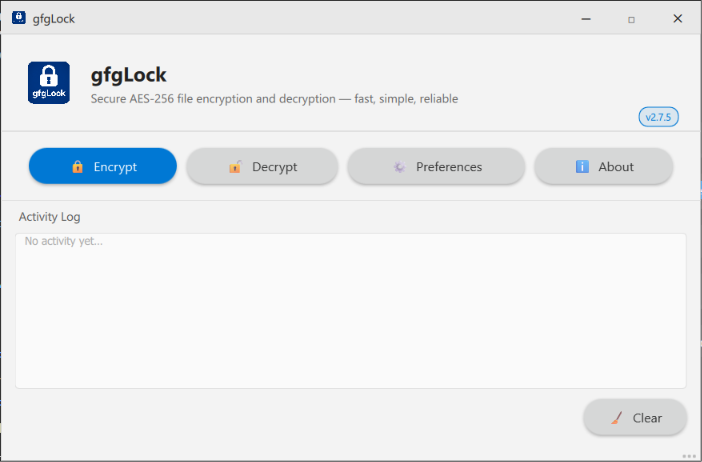
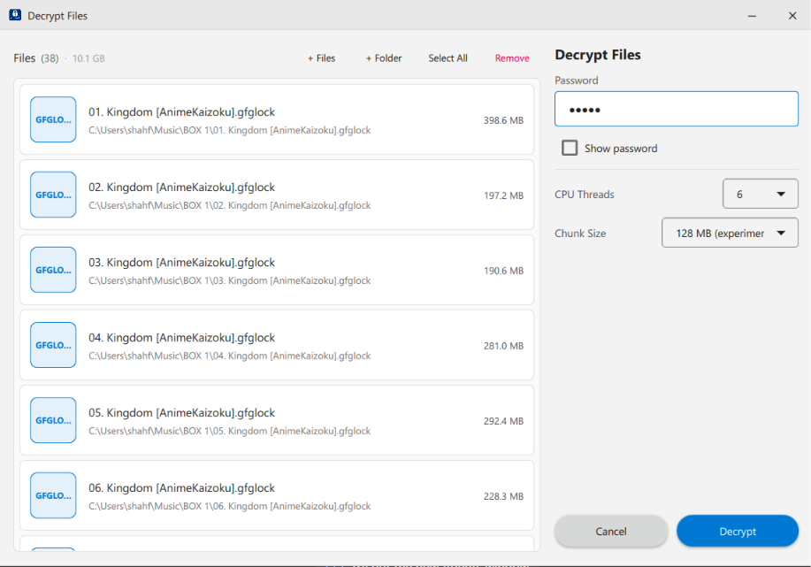
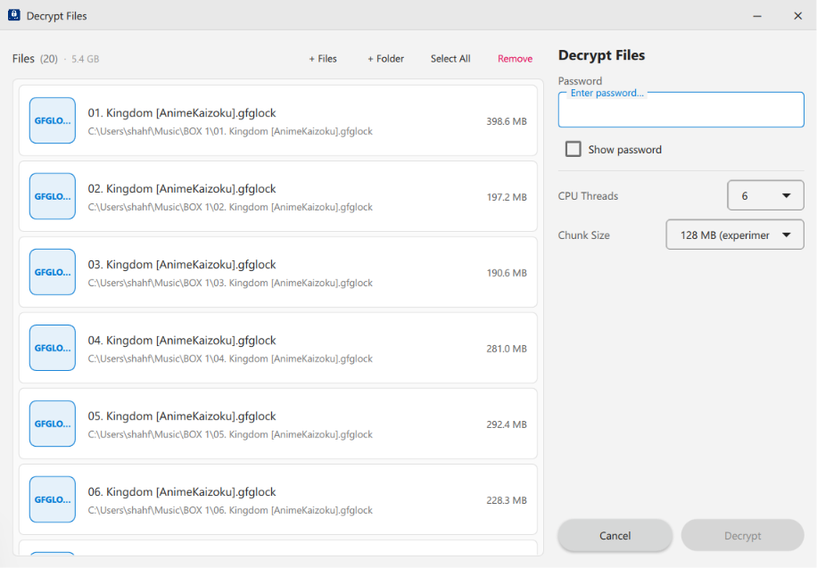
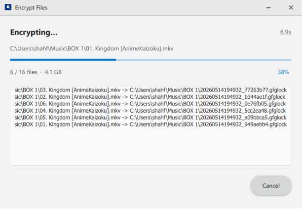
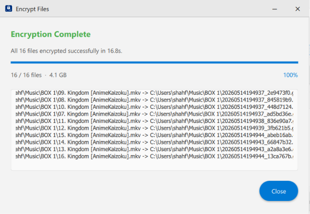
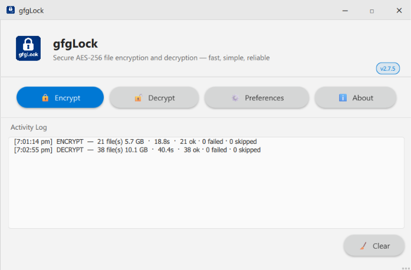
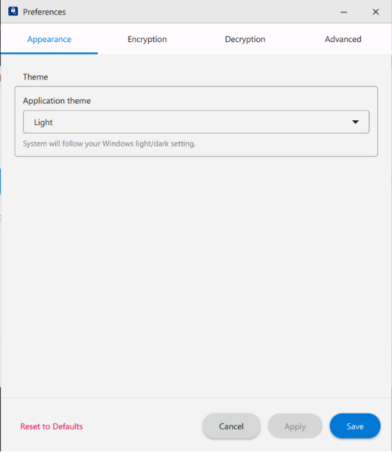

<div align="center">


# gfgLock

**Free, open-source file encryption for Windows - offline, private, and built to last.**

[](LICENSE)
[](https://github.com/ShahFaisalGfG/gfgLock/releases)
[](https://github.com/ShahFaisalGfG/gfgLock/releases/latest)
[](https://winstall.app/apps/gfgRoyal.gfgLock)

</div>

---

gfgLock is a **free, open-source** desktop app that encrypts and decrypts files using battle-tested cryptography - AES-256 GCM, AES-256 CFB, and ChaCha20-Poly1305 - all powered by a native C++ engine backed by OpenSSL. Drop files onto the window, enter a password, done. No account, no cloud, no subscription, no telemetry. Ever.

> *Your files. Your machine. Your rules.*



---

## Table of Contents

- [gfgLock](#gfglock)
  - [Table of Contents](#table-of-contents)
  - [Who Is This For?](#who-is-this-for)
  - [Why gfgLock?](#why-gfglock)
  - [Features](#features)
  - [Download \& Install](#download--install)
    - [Option 1 - Windows Package Manager (Recommended)](#option-1--windows-package-manager-recommended)
    - [Option 2 - Installers](#option-2--installers)
  - [Quick Start](#quick-start)
  - [Screenshots](#screenshots)
  - [Encryption Algorithms](#encryption-algorithms)
    - [Quick Decision Guide](#quick-decision-guide)
  - [Security](#security)
    - [Key Derivation](#key-derivation)
    - [Privacy Guarantees](#privacy-guarantees)
    - [Best Practices](#best-practices)
  - [Settings \& Preferences](#settings--preferences)
    - [Encryption \& Decryption](#encryption--decryption)
    - [Chunk Size Guide](#chunk-size-guide)
    - [Advanced](#advanced)
  - [Building from Source](#building-from-source)
    - [Prerequisites](#prerequisites)
    - [Development Setup](#development-setup)
    - [Full Build - Native Extension + All Installers](#full-build--native-extension--all-installers)
  - [Troubleshooting](#troubleshooting)
  - [Contributing](#contributing)
  - [Roadmap](#roadmap)
  - [Changelog](#changelog)
    - [v3.0.0 - June 2026 *(current)*](#v300--june-2026-current)
    - [v2.7.5 - May 2026](#v275--may-2026)
    - [v2.7.0 - December 2025](#v270--december-2025)
    - [v2.6.9 - December 2025](#v269--december-2025)
  - [License \& Credits](#license--credits)
  - [Support the Project](#support-the-project)

---

## Who Is This For?

gfgLock is for anyone who takes file privacy seriously without wanting to become a cryptography expert first:

- **Developers** storing sensitive config files, credentials, or client data locally
- **Freelancers & contractors** delivering confidential documents to clients
- **Students & researchers** protecting academic work, drafts, or datasets
- **Privacy-conscious users** who simply don't trust cloud sync with everything
- **IT professionals** needing a portable, no-admin-required encryption tool for remote work
- **Sensitive media owners** - private photos, videos, or personal archives you'd rather keep completely off the cloud

If you've ever thought *"I wish I could just lock this file"* - this is for you.

---

## Why gfgLock?

Most encryption tools make you choose between complexity and trust. Either the UI is a maze, the algorithm is outdated, or the app needs a cloud account to function. gfgLock was built to close that gap.

- 🔒 **100 % offline** - no accounts, no cloud sync, no telemetry, no pinging home
- ⚡ **Hardware-accelerated** - native C++ extension backed by OpenSSL; seamless Python fallback on any machine
- 🎨 **Modern, clean UI** - PySide6 + QML with System, Light, and Dark themes
- 🧩 **Three authenticated ciphers** - pick the right algorithm for the job
- 📦 **Three install modes** - system-wide, per-user (no admin), and portable (USB-friendly)
- 🖱️ **Context-menu integration** - right-click any file in Windows Explorer to encrypt or decrypt

---

## Features

- **Multi-algorithm support** - AES-256 GCM (`.gfglock`), AES-256 CFB (`.gfglck`), ChaCha20-Poly1305 (`.gfgcha`)
- **Native C++ engine** - OpenSSL-backed AES-NI hardware acceleration with transparent Python fallback
- **Batch processing** - encrypt or decrypt entire folders in one operation using multi-threading
- **Real-time progress** - per-file progress bar with remaining time estimation
- **Chunk-based streaming** - configurable 8 MB – 128 MB chunk sizes for large file handling
- **File Explorer context menu** - right-click any file → *Encrypt with gfgLock* / *Decrypt with gfgLock*
- **Drag & drop** - drop files or folders directly onto the window
- **Detailed logging** - full activity or critical-only log levels saved to `%APPDATA%\gfgLock\logs\`
- **Live theme switching** - System / Light / Dark with instant preview
- **Zero dependencies at runtime** - fully self-contained executable

---

## Download & Install

### Option 1 - Windows Package Manager (Recommended)

```powershell
winget install gfgRoyal.gfgLock
```

### Option 2 - Installers

| Package | Admin Required | Best For |
| --- | :---: | --- |
| [`gfgLock_3.0.0_system_installer.exe`](https://github.com/ShahFaisalGfG/gfgLock/releases/latest) | ✅ | Shared / corporate machines |
| [`gfgLock_3.0.0_user_installer.exe`](https://github.com/ShahFaisalGfG/gfgLock/releases/latest) | ❌ | Personal machines - recommended |
| [`gfgLock_3.0.0_portable.exe`](https://github.com/ShahFaisalGfG/gfgLock/releases/latest) | ❌ | USB drives, no-install environments |

Compressed `.7z` archives for all three variants are also available on the [Releases](https://github.com/ShahFaisalGfG/gfgLock/releases) page.

---

## Quick Start

1. **Add files** - drag & drop onto the window, or use **Add Files** / **Add Folder**
2. **Select an algorithm** - AES-256 GCM is the default; see [Encryption Algorithms](#encryption-algorithms) if unsure
3. **Choose Encrypt or Decrypt** - click the corresponding button
4. **Enter your password** - 12+ characters strongly recommended
5. **Start** - hit **Start** and watch real-time progress

Encrypted files are saved in the same folder as the original, identified by their extension. To decrypt, drop an encrypted file onto gfgLock - the algorithm is auto-detected from the extension, no configuration needed.

---

## Screenshots

<details>
<summary>📸 Click to expand screenshots</summary>
<br />

| Encryption | Decryption |
|---|---|
|  |  |

| Progress | Completed |
|---|---|
|  |  |

| Activity Logs | Preferences |
|---|---|
|  |  |

</details>

---

## Encryption Algorithms

| Algorithm | Extension | Type | Recommended For |
|---|---|---|---|
| **AES-256 GCM** | `.gfglock` | AEAD | ✅ General purpose - the safe default |
| **AES-256 CFB** | `.gfglck` | Stream | Large batches, speed-critical workflows |
| **ChaCha20-Poly1305** | `.gfgcha` | AEAD | CPUs without AES-NI; timing-attack resistance |

### Quick Decision Guide

```
Need strong, authenticated encryption?
  → AES-256 GCM  (authenticated, hardware-accelerated, recommended)

Encrypting large batches and need every bit of speed?
  → AES-256 CFB  (~40 % faster than GCM; verify file integrity separately)

Older hardware or need constant-time, timing-attack-resistant encryption?
  → ChaCha20-Poly1305  (AEAD, constant-time, no AES-NI required)
```

> ⚠️ **Compatibility:** Files encrypted with one algorithm cannot be decrypted with another. The algorithm is auto-detected on decryption from the file extension.
>
> ⚠️ **Version notice:** Files encrypted with v2.7.0 or earlier are not compatible with v2.7.5 or later due to a file-structure change.

---

## Security

### Key Derivation

Your password is never stored or transmitted anywhere. A unique encryption key is derived fresh for every single operation:

```
Password
  ↓
SHA-256 hash + random 16-byte salt
  ↓
PBKDF2-HMAC-SHA256  (200 000 iterations)
  ↓
256-bit encryption key
```

### Privacy Guarantees

- ❌ No telemetry or usage reporting
- ❌ No cloud sync or remote backup
- ❌ No accounts or registration required
- ❌ No third-party analytics or tracking

### Best Practices

- Use **strong, unique passwords** - 12+ characters, mixed case, numbers, and symbols
- Keep encrypted files in a **secure location** - gfgLock protects content, not storage
- Enable **logging** for audit trails in compliance-sensitive environments
- **Back up your passwords** - there is no recovery mechanism by design

---

## Settings & Preferences

### Encryption & Decryption

| Setting | Description |
|---|---|
| **CPU Threads** | 1 to *(cores − 1)* - trade raw speed for system responsiveness |
| **Chunk Size** | 8 MB (default) to 128 MB - larger chunks improve throughput on NVMe drives |
| **Encrypt Filenames** | Optionally randomise output filenames for additional obscurity |

### Chunk Size Guide

| Size | Best For |
|---|---|
| Off (stream mode) | Files under 10 MB - fastest, full file loaded into RAM |
| 8 MB | General use - balanced default |
| 16–32 MB | Files over 50 MB on modern desktops |
| 64 MB+ | Files over 500 MB on high-end NVMe systems |

### Advanced

| Setting | Description |
|---|---|
| **Performance** | CPU Thread Clamping [Disable Clamping for performance mode] |
| **Log Level** | Full (all operations) or Critical (errors only) |
| **Log Actions** | Clear all logs or open the logs folder |
| **Notifications** | Operation Completed alerts via Windows 11 style notification |

---

## Building from Source

### Prerequisites

- Python 3.11+
- [Visual Studio 2022 Build Tools](https://visualstudio.microsoft.com/downloads/) - *Desktop development with C++* workload
- CMake ≥ 3.25
- [Inno Setup 6](https://jrsoftware.org/isinfo.php)

### Development Setup

```powershell
# 1. Clone the repository
git clone https://github.com/ShahFaisalGfG/gfgLock.git
cd gfgLock

# 2. Create and activate a virtual environment
python -m venv .venv
.venv\Scripts\Activate.ps1

# 3. Install Python dependencies
pip install -r requirements.txt

# 4. Run directly (no native build required)
python -m gfglock
```

### Full Build - Native Extension + All Installers

```powershell
.\scripts\build.ps1
```

This single script runs `scripts\build_native.ps1` (bootstraps vcpkg, compiles OpenSSL + pybind11, builds the CMake project), then PyInstaller bundling, then Inno Setup compilation. Output lands in `build\installer\`.

> **First-run note:** vcpkg will clone from GitHub and download OpenSSL - internet access is required for the first build only.

---

## Troubleshooting

| Issue | Solution |
|---|---|
| *"Could not parse stylesheet"* warning | Harmless Qt startup message - no data loss, safe to ignore |
| File fails to decrypt | Verify the extension (`.gfglock`, `.gfglck`, `.gfgcha`), the password, and file integrity |
| Slow performance | Increase CPU Threads and/or chunk size in Preferences; close background apps |
| Context menu not appearing | Re-run the installer; use *Run as administrator* for the system installer |
| Logs not created | Enable logging in **Advanced** settings; check write permissions on `%APPDATA%\gfgLock\logs\` |

Still stuck? [Open an issue](https://github.com/ShahFaisalGfG/gfgLock/issues) with your log file and gfgLock version - I'll get back to you.

---

## Contributing

Contributions of all kinds are genuinely welcome - bug reports, fixes, new features, translations, or just improving a sentence in the docs.

1. **Fork** the repository and clone your fork
2. Create a feature branch: `git checkout -b feature/your-feature`
3. Make your changes and ensure:
   - `pyright` passes on all edited Python files
   - `qmllint` passes on all edited `.qml` files
4. Commit with a clear message and open a **Pull Request** targeting the `development` branch

For significant changes, please [open an issue](https://github.com/ShahFaisalGfG/gfgLock/issues) first to discuss the approach - it saves time for everyone and increases the chance your PR gets merged quickly.

Not sure where to start? Look for issues tagged [`good first issue`](https://github.com/ShahFaisalGfG/gfgLock/issues?q=is%3Aopen+label%3A%22good+first+issue%22).

---

## Roadmap

| Version | Planned Feature |
|---|---|
| v3.1.0 | Context menu improvements + Local Password Wallet |
| v3.2.0 | File integrity verification (SHA-256 checksums) |
| v3.3.0 | Resumable / pause-and-continue for large file operations |
| v4.0.0 | Cloud-encrypted password backup |

Have a feature idea or a use case we haven't thought of? [Start a discussion](https://github.com/ShahFaisalGfG/gfgLock/discussions) - feature requests that get traction move up the roadmap.

---

## Changelog

### v3.0.0 - June 2026 *(current)*
- 🚀 **Native engine:** C++ extension backed by OpenSSL - hardware-accelerated AES-256 GCM/CFB and ChaCha20-Poly1305 with seamless Python fallback
- 🧪 **Test suite:** Full `pytest` coverage - native path, Python fallback, and cross-path round-trip compatibility
- 🔧 **Build:** `scripts/build_native.ps1` automates MSVC + vcpkg + CMake compilation in one command
- 📁 Build scripts reorganised under `scripts/`

### v2.7.5 - May 2026
- 🎨 **UI rewrite:** PyQt6 widgets replaced with PySide6 + QML, Material-style interface
- ⏱️ Remaining time estimation during operations
- 🔑 Auto-focus password field; Enter key starts operation
- 🪵 Fixed log routing - critical and full log levels now correctly separated
- 🏗️ Added `scripts/build.ps1` one-command installer build

### v2.7.0 - December 2025
- ⚡ Optimised cipher performance; AES-NI hardware detection
- 🔁 Stream mode (chunk size *Off*) for small files

### v2.6.9 - December 2025
- ✨ Multi-algorithm support (AES-256 GCM/CFB, ChaCha20-Poly1305)
- ✨ Comprehensive logging, dynamic theme support, smart file filtering

[Full release notes →](release_notes/)

---

## License & Credits

Released under the [MIT License](LICENSE) - free to use, modify, and distribute.

Built with ❤️ by **Shah Faisal** · [Portfolio](https://shahfaisalgfg.github.io/shahfaisal/) · [shahfaisalgfg@outlook.com](mailto:shahfaisalgfg@outlook.com)

---

## Support the Project

gfgLock is free and will always stay free. If it's saved you time, protected a file that mattered, or just made your workflow a little smoother, here are a few ways to give back:

- ⭐ **Star the repo** - it takes two seconds and helps others find the project
- 🐛 **Report a bug** - honest feedback makes the tool better for everyone
- 💡 **Suggest a feature** - if you need it, chances are someone else does too
- 🔁 **Share it** - tell a friend, post it in a forum, or mention it in a blog post
- 🛠️ **Contribute code** - PRs are always welcome; see [Contributing](#contributing)

**[★ Star gfgLock on GitHub](https://github.com/ShahFaisalGfG/gfgLock)**

---

*Stay secure. Encrypt responsibly.* 🔐
