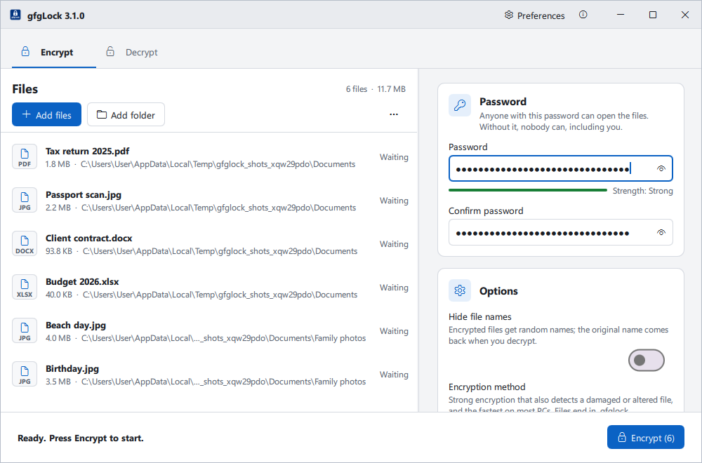
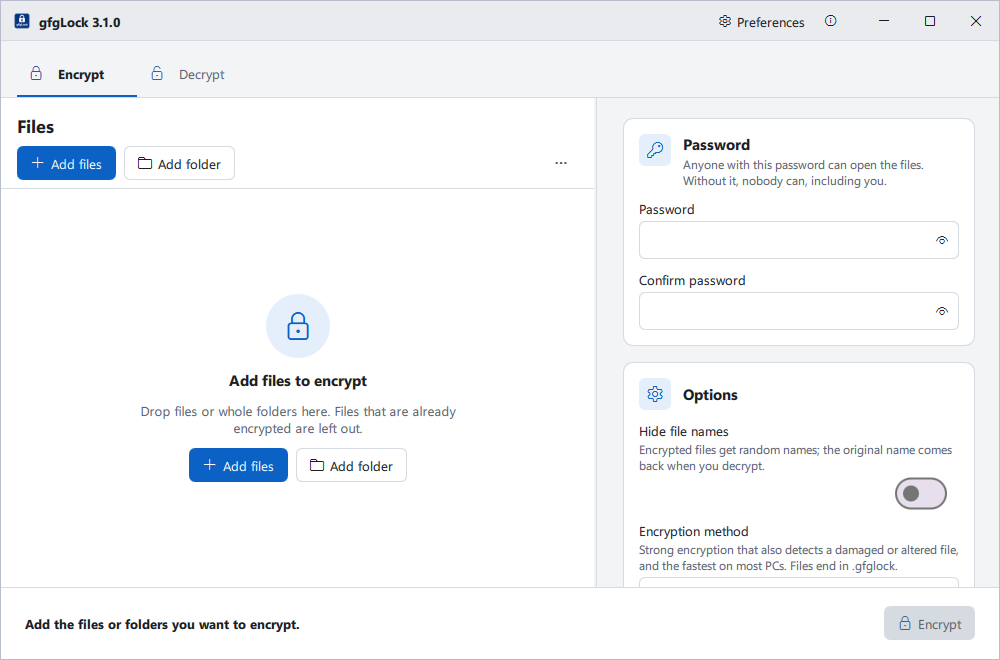
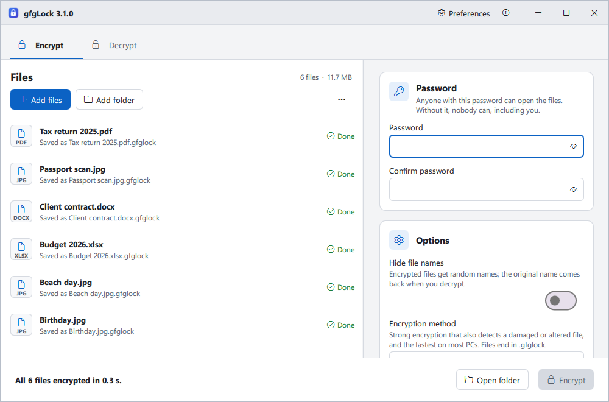
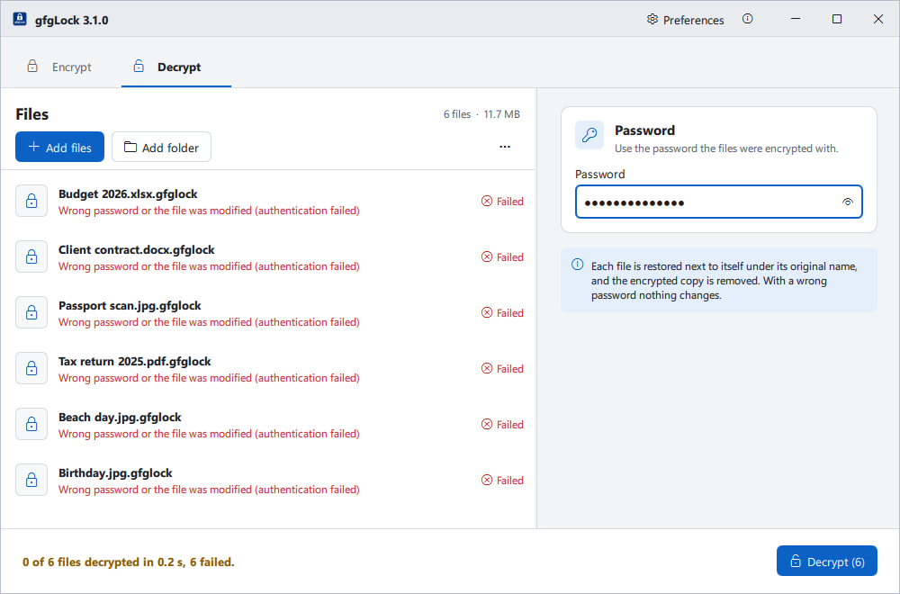
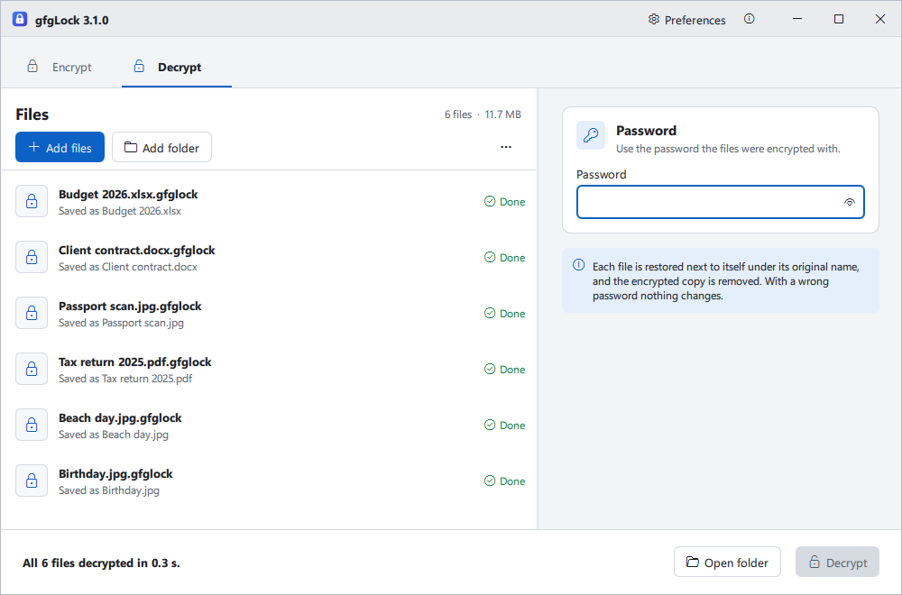
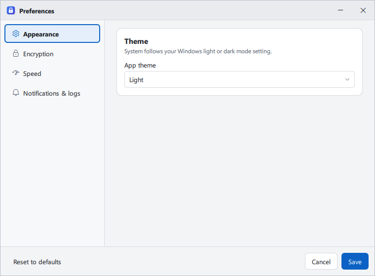
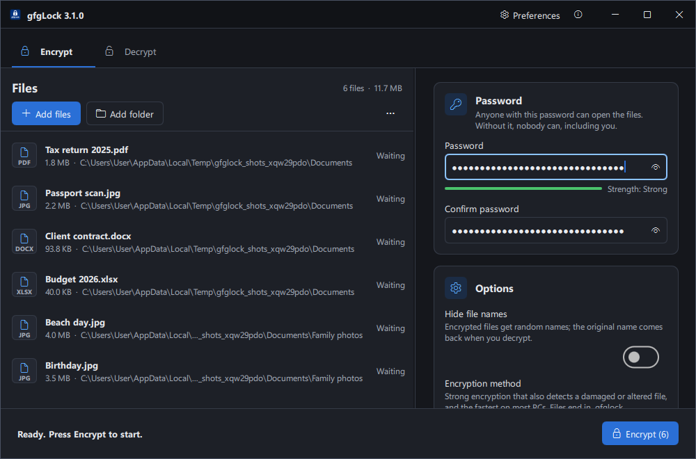
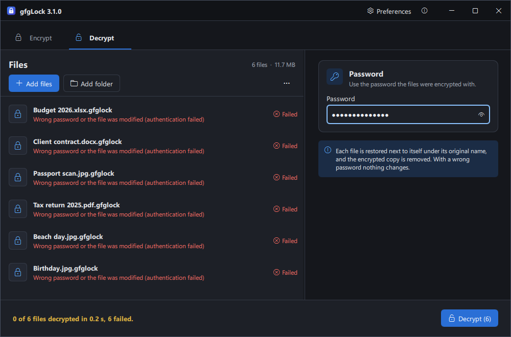

<div align="center">


# gfgLock

**Free, open-source file encryption for Windows - offline, private, and built to last.**

[](LICENSE)
[](https://github.com/ShahFaisalGfG/gfgLock/releases)
[](https://github.com/ShahFaisalGfG/gfgLock/releases/latest)
[](https://winstall.app/apps/gfgRoyal.gfgLock)

</div>

---

gfgLock is a **free, open-source** desktop app that encrypts and decrypts files using battle-tested cryptography - AES-256 GCM, AES-256 CFB, and ChaCha20-Poly1305 - all powered by a native C++ engine backed by OpenSSL. Drop files onto the window, enter a password, done. No account, no cloud, no subscription, no telemetry. Ever.

> *Your files. Your machine. Your rules.*



---

## Table of Contents

- [gfgLock](#gfglock)
  - [Table of Contents](#table-of-contents)
  - [Who Is This For?](#who-is-this-for)
  - [Why gfgLock?](#why-gfglock)
  - [Features](#features)
  - [Download \& Install](#download--install)
    - [Option 1 - Windows Package Manager (Recommended)](#option-1---windows-package-manager-recommended)
    - [Option 2 - Installers](#option-2---installers)
  - [Quick Start](#quick-start)
  - [Screenshots](#screenshots)
  - [Encryption Algorithms](#encryption-algorithms)
    - [Quick Decision Guide](#quick-decision-guide)
  - [Security](#security)
    - [Key Derivation](#key-derivation)
    - [Privacy Guarantees](#privacy-guarantees)
    - [Best Practices](#best-practices)
  - [Settings \& Preferences](#settings--preferences)
    - [Appearance](#appearance)
    - [Encryption](#encryption)
    - [Speed](#speed)
    - [Notifications \& Logs](#notifications--logs)
  - [Building from Source](#building-from-source)
    - [Prerequisites](#prerequisites)
    - [Development Setup](#development-setup)
    - [Full Build - Native Extension + All Installers](#full-build---native-extension--all-installers)
  - [Troubleshooting](#troubleshooting)
  - [Contributing](#contributing)
  - [Roadmap](#roadmap)
  - [Changelog](#changelog)
    - [v3.1.0 - October 2026 *(current)*](#v310---october-2026-current)
    - [v3.0.1 - July 2026](#v301---july-2026)
    - [v3.0.0 - June 2026](#v300---june-2026)
    - [v2.7.5 - May 2026](#v275---may-2026)
    - [v2.7.0 - December 2025](#v270---december-2025)
    - [v2.6.9 - December 2025](#v269---december-2025)
  - [License \& Credits](#license--credits)
  - [Support the Project](#support-the-project)

---

## Who Is This For?

gfgLock is for anyone who takes file privacy seriously without wanting to become a cryptography expert first:

- **Developers** storing sensitive config files, credentials, or client data locally
- **Freelancers & contractors** delivering confidential documents to clients
- **Students & researchers** protecting academic work, drafts, or datasets
- **Privacy-conscious users** who simply don't trust cloud sync with everything
- **IT professionals** needing a portable, no-admin-required encryption tool for remote work
- **Sensitive media owners** - private photos, videos, or personal archives you'd rather keep completely off the cloud

If you've ever thought *"I wish I could just lock this file"* - this is for you.

---

## Why gfgLock?

Most encryption tools make you choose between complexity and trust. Either the UI is a maze, the algorithm is outdated, or the app needs a cloud account to function. gfgLock was built to close that gap.

- 🔒 **100 % offline** - no accounts, no cloud sync, no telemetry, no pinging home
- ⚡ **Hardware-accelerated** - native C++ extension backed by OpenSSL; seamless Python fallback on any machine
- 🎨 **Modern, clean UI** - PySide6 + QML with System, Light, and Dark themes
- 🧩 **Three ciphers** - AES-256 GCM and ChaCha20-Poly1305 detect damaged or altered files; AES-256 CFB stays for older files
- 📦 **Three install modes** - system-wide, per-user (no admin), and a portable exe that keeps its settings beside itself (USB-friendly)
- 🖱️ **Context-menu integration** - right-click any file in Windows Explorer to encrypt or decrypt

---

## Features

- **Multi-algorithm support** - AES-256 GCM (`.gfglock`), AES-256 CFB (`.gfglck`), ChaCha20-Poly1305 (`.gfgcha`)
- **Native C++ engine** - OpenSSL-backed AES-NI hardware acceleration with transparent Python fallback
- **Batch processing** - encrypt or decrypt entire folders in one operation using multi-threading
- **A result for every file** - each file shows its own progress, then *Done* with the name it was saved as, *Skipped*, or *Failed* with the reason (for example a wrong password). Failed files stay in the list, so you can fix the problem and run them again
- **Guided form** - the Encrypt and Decrypt tabs say what is still missing before you can start, show password strength and mismatches, and explain what will happen to the files before anything changes
- **Fast on big files** - each file is read, encrypted, and written at the same time, so one large file encrypts about as fast as the disk can copy it
- **File Explorer context menu** - right-click any file → *Encrypt with gfgLock* / *Decrypt with gfgLock*; while gfgLock is open, more files you send this way join the same window
- **Drag & drop** - drop files or folders anywhere on the window; encrypted files go to the Decrypt tab and everything else to the Encrypt tab
- **Keyboard friendly** - every control can be reached with Tab and shows a focus outline, and the main actions have shortcuts
- **Detailed logging** - full activity or critical-only log levels saved to `%APPDATA%\gfgLock\logs\` (the portable exe: `gfgLock data\logs\` beside it)
- **Live theme switching** - System / Light / Dark with instant preview
- **Zero dependencies at runtime** - fully self-contained executable

---

## Download & Install

### Option 1 - Windows Package Manager (Recommended)

```powershell
winget install gfgRoyal.gfgLock
```

### Option 2 - Installers

| Package | Admin Required | Best For |
| --- | :---: | --- |
| [`gfgLock_3.1.0_system_installer.exe`](https://github.com/ShahFaisalGfG/gfgLock/releases/latest) | ✅ | Shared / corporate machines |
| [`gfgLock_3.1.0_user_installer.exe`](https://github.com/ShahFaisalGfG/gfgLock/releases/latest) | ❌ | Personal machines - recommended |
| [`gfgLock_3.1.0_portable.exe`](https://github.com/ShahFaisalGfG/gfgLock/releases/latest) | ❌ | USB drives and PCs where you can't install; settings and logs stay in a `gfgLock data` folder beside the exe |

Compressed `.7z` archives for all three variants are also available on the [Releases](https://github.com/ShahFaisalGfG/gfgLock/releases) page.

---

## Quick Start

**To lock files**

1. On the **Encrypt** tab, add files or folders: drag them onto the window, use **Add files** / **Add folder**, or right-click them in File Explorer and choose *Encrypt with gfgLock*
2. **Type a password twice** - 12+ characters strongly recommended; the strength meter helps
3. **Optional:** turn on **Hide file names**, or pick another encryption method (AES-256 GCM is the default; see [Encryption Algorithms](#encryption-algorithms) if unsure)
4. Press **Encrypt** - each file shows its progress, then *Done* and the name it was saved as

**To open them again**

1. On the **Decrypt** tab, add the encrypted files (or right-click them and choose *Decrypt with gfgLock*)
2. Enter the password and press **Decrypt** - each file gets its original name back. With a wrong password the files are marked *Failed* and nothing changes; correct the password and press **Decrypt** again

| Shortcut | Action |
|---|---|
| **Ctrl+1** / **Ctrl+2** | Encrypt tab / Decrypt tab |
| **Ctrl+O** / **Ctrl+Shift+O** | Add files / add a folder |
| **Enter** in a password box, **Ctrl+Enter**, or **F5** | Start |
| **Esc** | Stop a running job (files already being processed finish) or a folder scan |
| **Ctrl+,** / **F1** | Preferences / About |
| **Ctrl+A**, **Space**, **Ctrl+C**, **Delete** in the list | Select all, select a file, copy the file names, remove from the list |
| **Shift+F10** or the **Menu** key in the list | Show in folder, copy paths, and the other file actions |
| **Ctrl+S** / **Esc** in Preferences | Save / close without saving |

Encrypted files are saved in the same folder as the original under its full name plus the algorithm's extension (`report.docx` → `report.docx.gfglock`), and the original is removed only after the encrypted copy is completely written to disk. To decrypt, drop an encrypted file onto gfgLock - the algorithm is auto-detected from the extension, no configuration needed. Neither step ever overwrites an existing file: if the name is taken, the new file gets a suffix such as `report (2).docx`. Dropping a folder adds every file inside it, including subfolders; even folders with tens of thousands of files load in about a second.

---

## Screenshots

<details>
<summary>📸 Click to expand screenshots</summary>
<br />

| First launch | Ready to encrypt |
|---|---|
|  |  |

| Encrypted | Wrong password |
|---|---|
|  |  |

| Decrypted | Preferences |
|---|---|
|  |  |

| Dark theme | Dark theme |
|---|---|
|  |  |

</details>

---

## Encryption Algorithms

| Algorithm | Extension | Type | Recommended For |
|---|---|---|---|
| **AES-256 GCM** | `.gfglock` | AEAD | ✅ General purpose - the safe default |
| **AES-256 CFB** | `.gfglck` | Stream | Legacy: matching files made by older versions |
| **ChaCha20-Poly1305** | `.gfgcha` | AEAD | CPUs without AES-NI; timing-attack resistance |

### Quick Decision Guide

```
Need strong, authenticated encryption?
  → AES-256 GCM  (authenticated, hardware-accelerated, fastest on most PCs, recommended)

Need the same method as files made by older gfgLock versions?
  → AES-256 CFB  (legacy; slower than GCM and can't detect a damaged or altered file)

Older hardware or need constant-time, timing-attack-resistant encryption?
  → ChaCha20-Poly1305  (AEAD, constant-time, no AES-NI required)
```

> ⚠️ **Compatibility:** Files encrypted with one algorithm cannot be decrypted with another. The algorithm is auto-detected on decryption from the file extension.
>
> ⚠️ **Version notice:** Files encrypted with v2.7.0 or earlier are not compatible with v2.7.5 or later due to a file-structure change.

---

## Security

### Key Derivation

Your password is never stored or transmitted anywhere. A unique encryption key is derived fresh for every single operation:

```
Password (UTF-8) + random 16-byte salt
  ↓
PBKDF2-HMAC-SHA256  (200 000 iterations)
  ↓
256-bit encryption key
```

### Privacy Guarantees

- ❌ No telemetry or usage reporting
- ❌ No cloud sync or remote backup
- ❌ No accounts or registration required
- ❌ No third-party analytics or tracking

### Best Practices

- Use **strong, unique passwords** - 12+ characters, mixed case, numbers, and symbols
- Keep encrypted files in a **secure location** - gfgLock protects content, not storage
- Enable **logging** for audit trails in compliance-sensitive environments
- **Back up your passwords** - there is no recovery mechanism by design

---

## Settings & Preferences

Open **Preferences** from the title bar (**Ctrl+,**). Changes apply when you press **Save**; **Reset to defaults** asks before restoring everything.

### Appearance

| Setting | Description |
|---|---|
| **App theme** | System (follows your Windows light or dark mode), Light, or Dark |

### Encryption

| Setting | Description |
|---|---|
| **Encryption method** | The method the Encrypt tab starts with; each option explains its trade-offs. Decrypting picks the right method automatically |
| **Hide file names** | Give encrypted files random names by default; the original name comes back when you decrypt |

### Speed

| Setting | Description |
|---|---|
| **Files at a time** | How many files are encrypted or decrypted at once, set separately for each (1 up to your processor threads). Each file is already read, encrypted, and written at the same time, so this mostly speeds up batches of smaller files |
| **Keep the PC responsive** | Leave one processor thread free for Windows (on by default; turn off to use every thread) |
| **Read size** | How much of a file is read at once, set separately for encrypting and decrypting. The **Default (4 MB)** suits most PCs; 1 MB to 64 MB can be picked by hand. Each file being worked on holds about four times the size in memory |
| **Optimize for this PC** | Encrypts and decrypts a 256 MB test file in the temp folder with every read size (about a minute, with a progress bar), then selects and saves the fastest size for encrypting and for decrypting. Another size replaces the default only when it is at least 5% faster |

### Notifications & Logs

| Setting | Description |
|---|---|
| **Notify when finished** | Show a Windows notification when encrypting or decrypting ends |
| **Keep logs** / **What to log** | Write log files with errors only, or every file processed. Logs list file names, never passwords |
| **Open logs folder** / **Clear logs** | Show the log files in File Explorer, or empty them |

---

## Building from Source

### Prerequisites

- Python 3.11+
- [Visual Studio 2022 Build Tools](https://visualstudio.microsoft.com/downloads/) - *Desktop development with C++* workload
- CMake ≥ 3.25
- [Inno Setup 6](https://jrsoftware.org/isinfo.php)

### Development Setup

```powershell
# 1. Clone the repository
git clone https://github.com/ShahFaisalGfG/gfgLock.git
cd gfgLock

# 2. Create and activate a virtual environment
python -m venv .venv
.venv\Scripts\Activate.ps1

# 3. Install Python dependencies
pip install -r requirements.txt

# 4. Run directly (no native build required)
python -m gfglock
```

### Full Build - Native Extension + All Installers

```powershell
.\scripts\build.ps1
```

This single script runs `scripts\build_native.ps1` (bootstraps vcpkg, installs OpenSSL through it, and builds the CMake project), then PyInstaller bundling, Inno Setup compilation, and the portable exe. Each build runs the app's `--self-test` before it counts as done. The installers land in `build\installer\` and the portable exe in `build\`. See [dev_setup.md](dev_setup.md) for the individual scripts.

> **First-run note:** vcpkg will clone from GitHub and download OpenSSL - internet access is required for the first build only.

---

## Troubleshooting

| Issue | Solution |
|---|---|
| *"Could not parse stylesheet"* warning | Harmless Qt startup message - no data loss, safe to ignore |
| A file is marked *Failed* | Its row says why. "Wrong password or the file was modified" means the password is wrong or the file was damaged; correct the password and press **Decrypt** again. Nothing is changed when a file fails |
| A file I added isn't in the list | The Encrypt tab leaves out files that are already encrypted, and the Decrypt tab leaves out files that aren't; a notice says how many. Use the other tab for them |
| Slow performance | For many small files, raise **Files at a time** in **Preferences → Speed**. A single large file goes about as fast as the disk allows; close background apps that use the same disk |
| Context menu not appearing | Re-run the installer; use *Run as administrator* for the system installer |
| Logs not created | Turn on **Keep logs** in **Preferences → Notifications & logs**; check write permissions on `%APPDATA%\gfgLock\logs\` (portable exe: `gfgLock data\logs\` beside it) |

Still stuck? [Open an issue](https://github.com/ShahFaisalGfG/gfgLock/issues) with your log file and gfgLock version - I'll get back to you.

---

## Contributing

Contributions of all kinds are welcome - bug reports, fixes, new features, translations, or just improving a sentence in the docs.

1. **Fork** the repository and clone your fork
2. Create a feature branch: `git checkout -b feature/your-feature`
3. Make your changes and ensure:
   - `pyright` passes on all edited Python files
   - `qmllint` passes on all edited `.qml` files
4. Commit with a clear message and open a **Pull Request** targeting the `development` branch

For significant changes, please [open an issue](https://github.com/ShahFaisalGfG/gfgLock/issues) first to discuss the approach - it saves time for everyone and increases the chance your PR gets merged quickly.

Not sure where to start? Look for issues tagged [`good first issue`](https://github.com/ShahFaisalGfG/gfgLock/issues?q=is%3Aopen+label%3A%22good+first+issue%22).

---

## Roadmap

| Version | Planned Feature |
|---|---|
| v3.2.0 | Local Password Wallet |
| v3.3.0 | File integrity verification (SHA-256 checksums) |
| v3.4.0 | Resumable / pause-and-continue for large file operations |
| v4.0.0 | Cloud-encrypted password backup |

Have a feature idea or a use case we haven't thought of? [Start a discussion](https://github.com/ShahFaisalGfG/gfgLock/discussions) - feature requests that get traction move up the roadmap.

---

## Changelog

### v3.1.0 - October 2026 *(current)*
- 🛡️ **Fixed data loss:** files with the same name but different extensions (`report.docx`, `report.pdf`) were both encrypted to `report.gfglock`, so one original was lost. Encrypted files now keep the full original name, and no operation ever overwrites an existing file.
- 🛡️ **Fixed unsafe decryption names:** the file name stored inside an encrypted file is now validated. A tampered file can no longer write outside its folder, to a device name such as `NUL`, or into a hidden NTFS stream.
- 🛡️ **Safer writes:** output goes to a temporary file, is size-checked and flushed to disk, and only then replaces the name and removes the source. Failed or wrong-password operations leave the original untouched, and authenticated modes (GCM, ChaCha20-Poly1305) never expose plaintext before the authentication tag is verified.
- 🛡️ **Nothing is left in both forms:** a read-only file, or one open in another program, now fails with the reason before anything is written, or has its new copy removed again, instead of ending up both encrypted and unencrypted. Interrupted jobs no longer leave temporary files behind.
- 🛡️ **Links are skipped:** encrypting a symbolic link used to remove the link and leave the file it points to readable. Folder scans also no longer follow junctions, which could loop forever.
- 🛡️ **Closing during a job asks first,** then lets the files in progress finish before gfgLock closes.
- 🐛 **Fixed:** files with non-ASCII names (`résumé.txt`) failed to encrypt on the native path, and names like `café.txt` were restored garbled.
- 🐛 **Fixed:** encrypting a file named like `A.GFGLOCK` could delete it; dropping a folder added the folder itself instead of its files.
- 🐛 **Fixed:** turning **Keep the PC responsive** on or off reset **Files at a time** to 1.
- ⚡ **Faster encryption:** reading, encrypting, and writing a file now overlap instead of taking turns, so a large file encrypts and decrypts about 1.5 times faster, at about the speed of the disk (a 1 GB file on a SATA SSD: about 3.8 s instead of 5.5 s).
- ⚡ **Read size:** now defaults to 4 MB (which measured fastest on a typical desktop), applies to decrypting as well (it used to be ignored there), and **Optimize for this PC** in **Preferences → Speed** times every size on your PC, then selects and saves the fastest. A read size picked in an earlier version is kept (128 MB becomes 64 MB, the new maximum); the old defaults become the new default.
- ⚡ **Large folders:** folders are scanned in the background (also from the Explorer context menu) with a live count and a Stop button; removing thousands of files from the list is instant.
- 🎨 **Redesigned interface:** one window with **Encrypt** and **Decrypt** tabs replaces the launcher and its pop-up dialogs, in the same design as CC-Gen-Ultimate. Each tab keeps its own file list, and every file shows its progress and result (*Done* with the name it was saved as, *Skipped*, or *Failed* with the reason). Failed files stay in the list to retry, finished ones can be removed, and the right-click menu offers **Show in folder** and copying names or paths. The number of files at a time moved to **Preferences → Speed**, so the tabs only ask for what each job needs.
- 🎨 **New icon:** a bold white padlock on a blue-to-indigo tile, without the old built-in text that couldn't be read at taskbar size. It shares its shape with CC-Gen-Ultimate's new icon, and the splash screen's progress bar uses the same colours. `scripts/make_icons.py` draws every size and the `.ico`.
- 🎨 Dialogs dim the window with a dark layer in both themes; in the dark theme they used to fade it to a pale grey that looked like a frozen app.
- 🧭 **Easier to use:** each tab says what is missing before it can start, shows password strength (in words as well as a bar) and mismatches, and explains what will happen to the files. Notices explain files that were left out. Every control can be reached with Tab and shows a focus outline. Shortcuts: **Ctrl+1** / **Ctrl+2** tabs, **Ctrl+O** add files, **Ctrl+Shift+O** add folder, **Ctrl+Enter** or **F5** start, **Esc** stop, **Ctrl+,** preferences, **F1** about.
- 🧭 Files can be added while a job runs; they wait for the next run, and a notice says so. Rows can't be removed mid-run, and a stopped or partly failed run keeps the password so the rest can run without typing it again.
- 🖱️ **One window:** dropping files anywhere sends encrypted files to Decrypt and the rest to Encrypt, and files sent from the Explorer context menu while gfgLock is open join that window instead of opening another.
- 🧩 **Context menu:** "Decrypt with gfgLock" only appears when the selection contains encrypted files or folders, and launch failures are reported instead of being ignored.
- 🏷️ AES-256 CFB is now labelled *legacy*: measured on current PCs it is the slowest of the three methods, and it can't detect a damaged or altered file.
- 🧪 **Release checks:** every build runs the frozen app with `--self-test` (native engine, all algorithms on both the native and Python paths, every QML screen, and every image the app shows), so a missing module or DLL fails the build instead of reaching users. The test suite and the QML linter also run on every push and pull request, and builds use pinned Python packages and a pinned vcpkg commit (OpenSSL 3.6.5), so a release can be rebuilt as it shipped.
- 🔧 The Python fallback uses AES-CFB from its new location in `cryptography`, so future `cryptography` releases keep opening `.gfglck` files.
- 🔧 **Installers:** the system-wide uninstaller no longer deletes every user's `%APPDATA%\gfgLock` folder (which held other users' per-user installs and settings), and uninstalling never deletes other files in the install folder. Explorer refreshes file icons after install, and `THIRD_PARTY_NOTICES.md` and the offline readme are installed under `docs`.
- 🔧 A damaged or hand-edited settings file can no longer stop Start from working; values of the wrong type fall back to their defaults.
- 📦 **The portable exe is portable:** it keeps its settings and logs in a `gfgLock data` folder beside itself instead of in `%APPDATA%`, and takes over the settings of an earlier version on its first start. On a drive it can't write to, it falls back to `%APPDATA%\gfgLock`.
- 🔧 gfgLock is released under the MIT License; the `LICENSE` file, which the readme linked to, is now included.
- 🔧 The native engine (`gfglock_native`) now exposes API version 4; an outdated module is ignored in favour of the Python fallback. Files from earlier versions decrypt unchanged.

### v3.0.1 - July 2026
- 🖼️ **Startup splash screen:** live dependency-loading progress shown while the app boots
- 🐛 **Fixed:** unified system/user installer AppIds - resolves duplicate Add/Remove Programs entries
- 🐛 **Fixed:** user (non-admin) installer no longer schedules a reboot-time file replacement for the shell extension DLL, which required admin rights it doesn't have

### v3.0.0 - June 2026
- 🚀 **Native engine:** C++ extension backed by OpenSSL - hardware-accelerated AES-256 GCM/CFB and ChaCha20-Poly1305 with seamless Python fallback
- 🧪 **Test suite:** Full `pytest` coverage - native path, Python fallback, and cross-path round-trip compatibility
- 🔧 **Build:** `scripts/build_native.ps1` automates MSVC + vcpkg + CMake compilation in one command
- 📁 Build scripts reorganised under `scripts/`

### v2.7.5 - May 2026
- 🎨 **UI rewrite:** PyQt6 widgets replaced with PySide6 + QML, Material-style interface
- ⏱️ Remaining time estimation during operations
- 🔑 Auto-focus password field; Enter key starts operation
- 🪵 Fixed log routing - critical and full log levels now correctly separated
- 🏗️ Added `scripts/build.ps1` one-command installer build

### v2.7.0 - December 2025
- ⚡ Optimised cipher performance; AES-NI hardware detection
- 🔁 Stream mode (chunk size *Off*) for small files

### v2.6.9 - December 2025
- ✨ Multi-algorithm support (AES-256 GCM/CFB, ChaCha20-Poly1305)
- ✨ Comprehensive logging, dynamic theme support, smart file filtering

[Full release notes →](release_notes/)

---

## License & Credits

Released under the [MIT License](LICENSE) - free to use, modify, and distribute.

Built with ❤️ by **Shah Faisal** · [Portfolio](https://shahfaisalgfg.github.io/shahfaisal/) · [shahfaisalgfg@gmail.com](mailto:shahfaisalgfg@gmail.com)

---

## Support the Project

gfgLock is free and will always stay free. If it's saved you time, protected a file that mattered, or just made your workflow a little smoother, here are a few ways to give back:

- ⭐ **Star the repo** - it takes two seconds and helps others find the project
- 🐛 **Report a bug** - honest feedback makes the tool better for everyone
- 💡 **Suggest a feature** - if you need it, chances are someone else does too
- 🔁 **Share it** - tell a friend, post it in a forum, or mention it in a blog post
- 🛠️ **Contribute code** - PRs are always welcome; see [Contributing](#contributing)

**[★ Star gfgLock on GitHub](https://github.com/ShahFaisalGfG/gfgLock)**

---

*Stay secure. Encrypt responsibly.* 🔐
